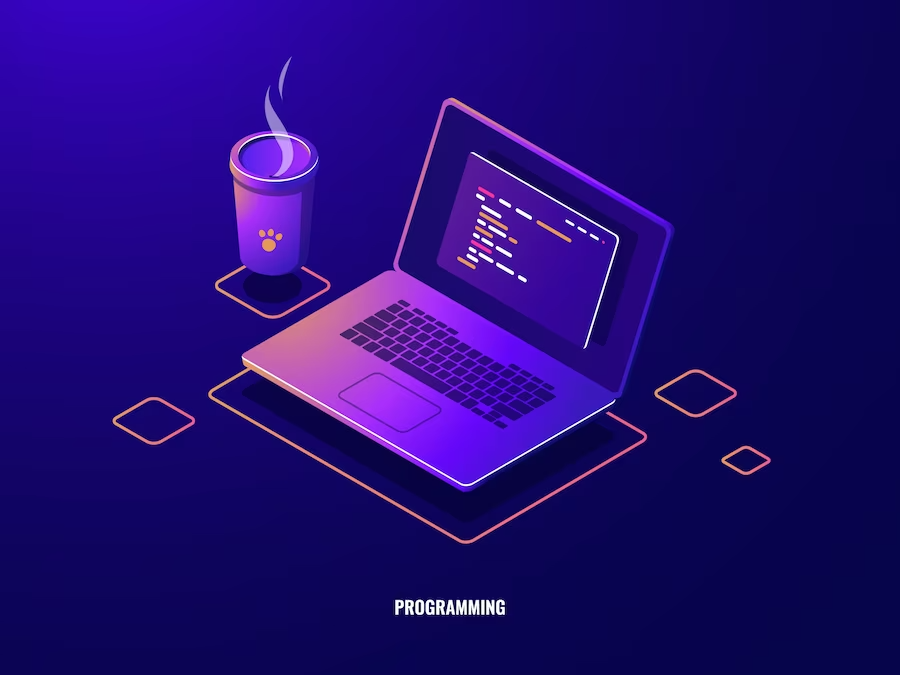

## Quel est le but de ce projet ?

<b>Aider les développeurs, débutants ou expérimentés, à trouver les outils et les langages de programmation les plus adaptés à leurs besoins.</b>

## Comment ça fonctionne ?

1. <b>Pour chaque outil et langage, le site fournit une description détaillée</b>, des exemples d'utilisation, des tutoriels et des liens vers la communauté.
2. <b>Le développeur peut également consulter des articles et des guides</b> pour l'aider à choisir les meilleurs outils pour son projet.

 ## Quels avantages ?
 
1. <b>Gain de temps et d'énergie :</b> le développeur n'a pas à passer des heures à rechercher les outils et les langages qui lui conviennent.
2. <b>Choix éclairé :</b> le développeur a accès à toutes les informations dont il a besoin pour prendre une décision réfléchie.
3. <b>Développement plus efficace :</b> le développeur utilise les outils et les langages les plus adaptés à ses besoins, ce qui lui permet de travailler plus rapidement et de manière plus productive.

## Quels public ciblés ?

1. <b>Développeurs débutants</b> qui ne savent pas quels outils et langages choisir.
2. <b>Développeurs expérimentés</b> qui recherchent de nouveaux outils pour améliorer leur productivité.
3. <b>Étudiants en informatique</b> qui veulent découvrir les différents langages de programmation.

À bientôt et merci à ceux qui me soutiennent en laissant une ⭐ dans mon projet sur <a href="https://github.com/mpcgt/levetica">GitHub</a> 😊
